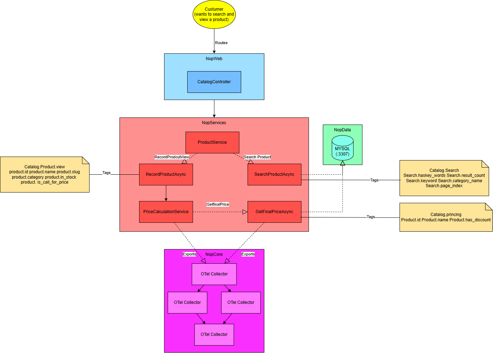
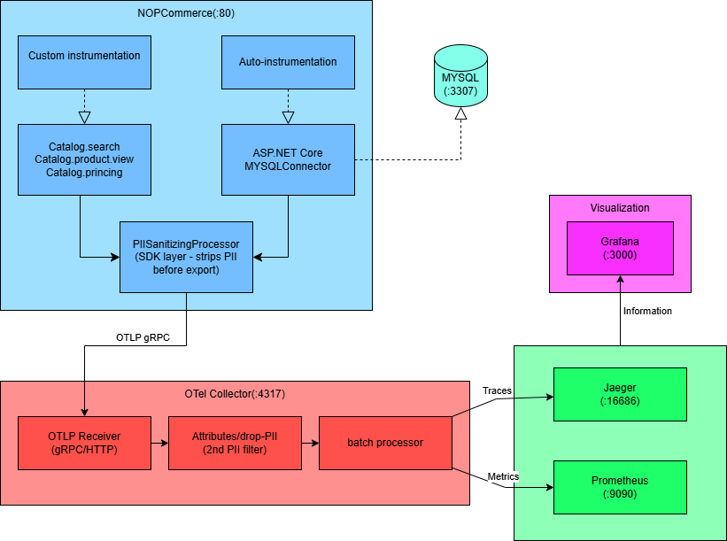
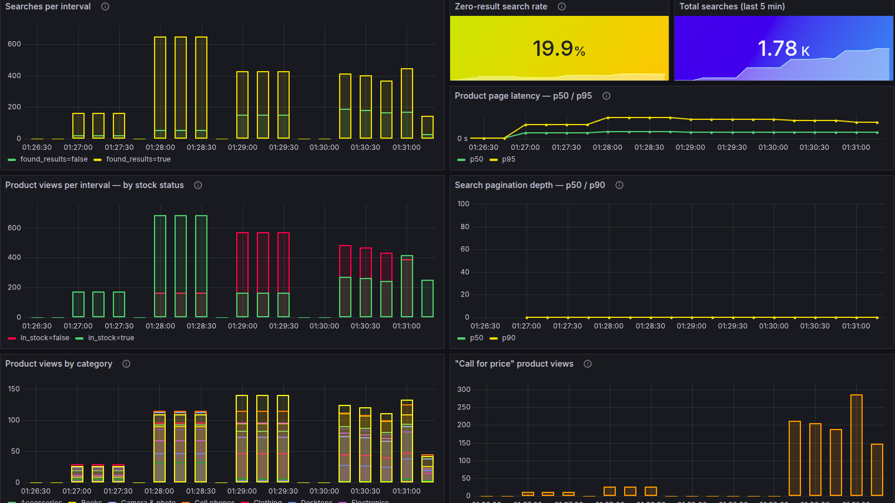
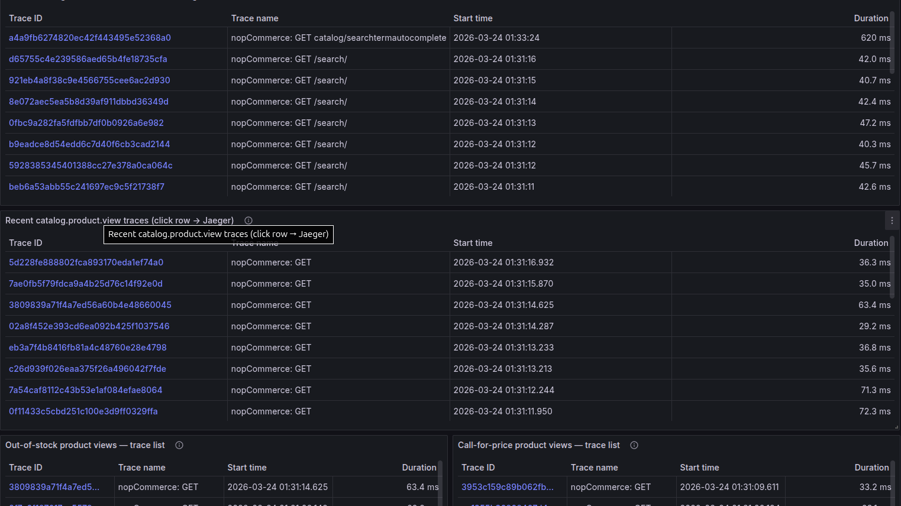
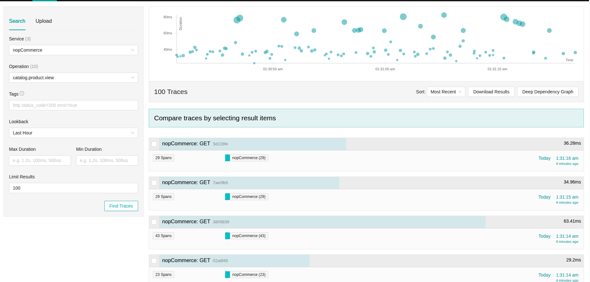
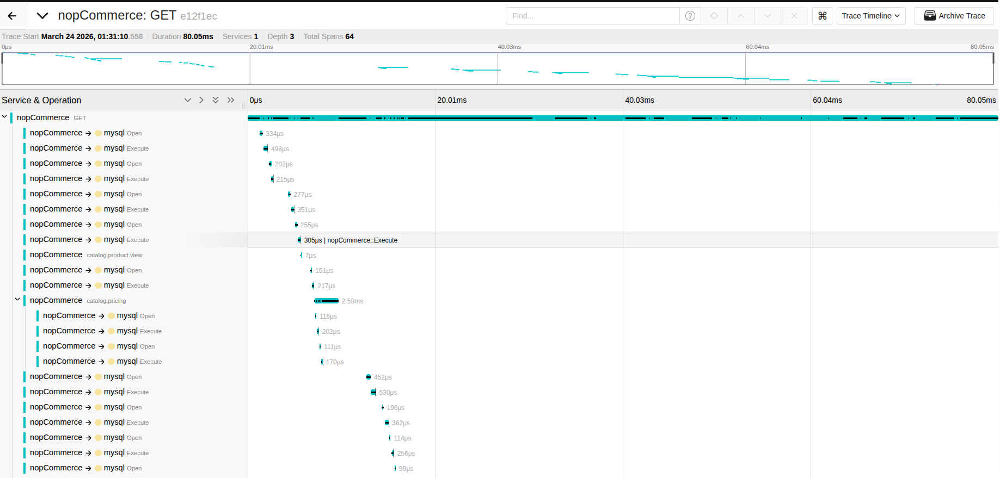
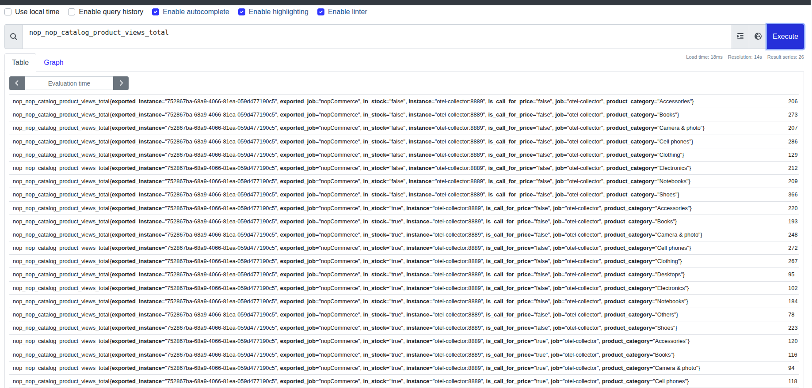

# Assignment 1 — nopCommerce + OpenTelemetry

**Software Architectures** | Master in Informatics Engineering | Individual Assignment

---

## 1. Architecture Analysis

### Layer Structure



nopCommerce follows a strict **five-layer architecture** with compiler-enforced unidirectional dependencies, every arrow points downward, lower layers have zero knowledge of upper ones:

```
Nop.Web  (Presentation)
    └─▶ Nop.Web.Framework  (MVC filters, routing, middleware)
            └─▶ Nop.Services  (Business logic, one service per domain)
                    └─▶ Nop.Data  (linq2db repositories, FluentMigrator)
                            └─▶ Nop.Core  (Domain entities, interfaces, no project deps)
```

All cross-cutting concerns (caching, events, logging) are defined as interfaces in `Nop.Core` and implemented in `Nop.Services` or `Nop.Web.Framework`, keeping the direction clean. The full analysis is in [`ARCHITECTURE.md`](ARCHITECTURE.md).

### IEventPublisher — Internal Event Mechanism

nopCommerce uses in-process pub/sub for inter-service communication. `EventPublisher.PublishAsync` resolves all `IConsumer<T>` implementations at runtime via Autofac and calls them sequentially. The primary use today is cache invalidation, over 100 `*CacheEventConsumer` files across `Nop.Services`. The event boundary is also a natural instrumentation point: a single consumer can observe domain events without touching business logic.

### Where Observability Is Easy vs Hard

**Easy:**
- **Service layer**: all services are constructor-injected interfaces — `ActivitySource.StartActivity()` drops in without modifying business logic
- **Async throughout**: `Activity` flows via `AsyncLocal`, so a span started at the controller is automatically parent of everything awaited below — no manual context threading
- **MySqlConnector 2.x**: built-in OTel `ActivitySource` — registered with `.AddSource("MySqlConnector")`, zero extra packages

**Hard:**
- **`EngineContext.Current` static locator**: appears in ~35 locations including `EventPublisher` itself — services resolved this way cannot be wrapped by DI decorators, breaking the standard OTel instrumentation pattern
- **SEO product URLs**: product pages use slug-based routes (`/apple-macbook-pro-13-inch`), so `http_route` is always `(missing)`, HTTP auto-metrics cannot identify product page traffic without a custom counter
- **Silent consumer failures**: `EventPublisher` catches and swallows all consumer exceptions, logging only to the DB, failures are invisible to metrics or traces without modifying the core class
- **`IStaticCacheManager`**: caching is transparent across the stack, impossible to distinguish cache hits from DB queries without instrumenting the cache manager globally

### Approach

All instrumentation was added as **surgical additions**, no business logic was modified. `NopTelemetry` centralises all `ActivitySource` and `Meter` definitions in `Nop.Services`, using only `System.Diagnostics` primitives (part of the .NET runtime). OTel NuGet packages remain a `Nop.Web` concern only, zero new dependencies in lower layers.

---

## 2. Instrumented Flows



### Flow — Customer Searches and Views a Product

**Why this flow**: covers Catalogue · Search · Pricing. The search index and pricing pipeline can fail silently, an HTTP 200 with zero results or a wrong price is invisible to error-rate monitors but immediately detectable with the right metrics.

#### Span Hierarchy

```
GET /search?q=laptop                        
  └── catalog.search                        ← custom (ProductService.SearchProductsAsync)
        ├── tags: search.has_keyword, search.result_count,
        │         search.keyword,search.page_index, search.category_filter,search.category_name,search.price_filter, search.sort_order
        └── MySqlConnector × N              

GET /apple-macbook-pro                     
  └── catalog.product.view                 ← custom (ProductService.RecordProductViewAsync)
        ├── tags: product.id, product.name, product.slug,
        │         product.category, product.type,
        │         product.is_call_for_price, product.in_stock
        ├── catalog.pricing                 ← custom (PriceCalculationService.GetFinalPriceAsync)
        │     tags: product.id, product.name, pricing.include_discounts,
        │           pricing.quantity, pricing.has_discount
        └── MySqlConnector × N              
```

**Note on span placement**: All spans live in `Nop.Services`. `catalog.product.view` is emitted by `ProductService.RecordProductViewAsync`, called from the controller with a single line. `catalog.search` is emitted by `ProductService.SearchProductsAsync`. `catalog.pricing` is emitted by `PriceCalculationService.GetFinalPriceAsync`. The controller is completely decoupled from observability concerns.

**Note on filtering**: `catalog.search` spans and metrics are only emitted for public-facing keyword searches (`showHidden=false`). Internal calls from admin panel, related products, and cross-sells are excluded, without this guard the counters would count every internal catalogue query, not just user searches.

#### Custom Metrics

| Metric | Type | Tags | Operational justification |
|--------|------|------|--------------------------|
| `nop.catalog.searches` | Counter | `found_results` | Tag `found_results=false` enables alerting on zero-result rate — a spike means catalogue content is missing or the search index is broken, catchable before users start abandoning the site. |
| `nop.catalog.search.page_depth` | Histogram | — | Page index requested per keyword search (0 = first page). p90 rising above 1 means users regularly paginate past the first page, a leading indicator of poor search relevance before abandonment rates rise. |
| `nop.catalog.product_views` + `product_category` | Counter | `product_category` | Product pages use SEO URLs so `http_route` is always `""` in auto metrics, no built-in way to count views by category. Category name is resolved at instrumentation time via a join on `ProductCategory → Category`. |
| `nop.catalog.product_views` + `in_stock` | Counter | `in_stock` | Out-of-stock views are lost-revenue events invisible to HTTP error monitors (page returns 200). `in_stock=false` makes them alertable: a sustained count signals products that need restocking or unpublishing. |
| `nop.catalog.product_views` + `is_call_for_price` | Counter | `is_call_for_price` | Call-for-price products never appear in revenue metrics. `is_call_for_price=true` surfaces demand for premium items, useful for the sales team to prioritise high-value follow-up. |

---

## 3. Privacy Strategy — Defence in Depth

### In Code

Only operational attributes are recorded. Each tag was a deliberate choice:

- **Included**: `search.has_keyword`, `search.keyword`, `search.result_count`, `search.page_index`, `search.category_filter`, `search.category_name`, `search.price_filter`, `search.sort_order`, `product.id`, `product.name`, `product.slug`, `product.category`, `product.type`, `product.in_stock`, `product.is_call_for_price`, `pricing.include_discounts`, `pricing.has_discount`
- **Excluded**: customer email, billing/shipping address, customer name, payment card details, cookie values, authorization headers

Product names (`product.name`) are public catalogue data, recording them in spans is standard observability practice and enables identifying exactly which product was viewed or priced in Jaeger without any additional lookup.

**`search.keyword` — conditional recording:** the raw keyword is only attached to the span when the search returns **zero results**. This is a deliberate trade-off: zero-result searches are catalogue gap signals (the store is missing a product the customer wants), so the keyword has direct operational value. Successful searches (where results were found) do not record the keyword, there is no actionable insight in knowing what a customer typed when they already found what they wanted, and the exposure is not justified. A customer searching for their own name or email will only leave a trace if that search returns no products, which is an edge case with negligible risk compared to the business value of identifying catalogue gaps.

### SDK Layer — PiiSanitizingProcessor

A custom `BaseProcessor<Activity>` registered in the OTel SDK strips known PII attribute keys from every span before export, regardless of where they were set:

```csharp
private static readonly HashSet<string> _blocklist = new(StringComparer.OrdinalIgnoreCase)
{
    "customer.email", "customer.username", "customer.phone",
    "billing.name", "billing.address", "billing.city", "billing.postcode",
    "http.request.header.cookie", "http.request.header.authorization",
    "http.response.header.set-cookie",
    "db.statement",   // raw SQL may contain literal values
};
```

This catches PII that auto-instrumentation (ASP.NET Core, MySqlConnector) might attach without our knowledge.

### Collector Layer — attributes/drop_pii processor

The OTel Collector applies a second filter before data reaches Jaeger or Prometheus. This matters because the Collector receives spans from all sources, not just our code. Configuration: [`observability/otel-collector-config.yaml`](observability/otel-collector-config.yaml).

**Rejected alternative**: filtering only in code — fragile, because auto-instrumentation operates outside our control.

---

## 4. Grafana Dashboards

### Catalogue Search Dashboard (`nop-catalog-search`)





| Panel | Purpose |
|-------|---------|
| Search volume / min | Search throughput split by `found_results` — immediate signal if zero-result rate spikes |
| Zero-result rate | Fraction of searches returning no products, above 30% triggers red threshold |
| Total searches (window) | Single number: total searches in the selected time range |
| Product page latency p50/p95 | HTTP latency for SEO-URL product pages (filtered by `http_route=""` — empty because slug-based URLs match no route template) |
| Product views / min | Product page traffic split by stock status (`in_stock=true/false`) |
| Search pagination depth p50/p90 | Page index per search, p90 > 1 indicates poor search relevance |
| Product views by category | Traffic volume per catalogue category, reveals which categories drive the most (and least) traffic |
| "Call for price" views / min | Demand for premium products where price is hidden |
| Traces, catalog.search | Last 20 traces containing a `catalog.search` span (filtered by `search.has_keyword=true` tag) |
| Traces, catalog.product.view | Last 20 traces containing a `catalog.product.view` span |

> **Note on trace panels**: Jaeger always displays the root span (the HTTP GET) as the row label. The `catalog.search` and `catalog.product.view` spans are visible inside each trace after clicking through.

### Jaeger — Trace Detail





### Prometheus — Metrics Explorer



---

## 5. Load Tests

### Search & product view flow — [`load-test/search-flow.js`](load-test/search-flow.js)

Five sequential phases, each producing a distinct traffic composition visible in the Grafana dashboards:

| Phase | Duration | VUs | Composition | Expected dashboard signal |
|-------|----------|-----|-------------|--------------------------|
| 1 — Normal browsing | 0–1 min | 8 | 90% found, 5% out-of-stock, 5% call-for-price | Green baseline across all panels |
| 2 — Category explorer | 1–2 min | 12 | Each VU browses one category: in-stock → out-of-stock | **Product views by category** shows distinct bars per category |
| 3 — Catalogue stress | 2–3 min | 15 | 60% zero-result searches + heavy out-of-stock views | **Zero-result rate** turns red (>30%); **Product views by stock** `in_stock=false` bar spikes; Jaeger out-of-stock trace list fills |
| 4 — Premium demand | 3–4 min | 12 | 60% call-for-price views across categories | **"Call for price" views** panel spikes; Jaeger call-for-price trace list shows which premium products were viewed |
| 5 — Recovery | 4–5 min | 8 | 15% zero-result, 15% out-of-stock, 15% call-for-price | All metrics return to baseline |

```bash
k6 run load-test/search-flow.js

# Override base URL
k6 run -e BASE_URL=http://localhost:80 load-test/search-flow.js
```

| Threshold | Value |
|-----------|-------|
| Search p95 duration | < 2 000 ms |
| Product page p95 duration | < 3 000 ms |
| HTTP error rate | < 1% |

---

## 6. How to Run

### Prerequisites

- Docker and Docker Compose
- k6 (load test only): [k6.io/docs/getting-started/installation](https://k6.io/docs/getting-started/installation/)

### 1. Start everything

```bash
docker compose up -d --build
```

This starts: nopCommerce · MySQL · OTel Collector · Jaeger · Prometheus · Grafana

### 2. First-time installation

Open `http://localhost:80` and complete the nopCommerce setup wizard:

- **Database type**: MySQL
- **Server name**: `nopcommerce_mysql`
- **Database name**: `nopcommerce`
- **Username / Password**: `root` / `nopCommerce_db_password`

After installation, wait ~30 seconds for the app to restart.

### 3. Observability UIs

| Tool | URL | Credentials |
|------|-----|-------------|
| nopCommerce | `http://localhost:80` | — |
| Grafana | `http://localhost:3000` | admin / admin |
| Jaeger | `http://localhost:16686` | — |
| Prometheus | `http://localhost:9090` | — |

### 4. Generate telemetry

1. Browse to `http://localhost:80`, search for a product and open its detail page
2. In Jaeger: select service `nopCommerce`, operation `catalog.search` or `catalog.product.view`
3. In Grafana: open **nopCommerce — Catalogue Search & Product View**

### 5. Run the load test

```bash
k6 run load-test/search-flow.js
```

### 6. Stop everything

```bash
docker compose down
```

To also wipe data volumes (reset to fresh install):

```bash
docker compose down -v
```

---

## 7. Files Changed

| File | What changed |
|------|-------------|
| `src/Libraries/Nop.Services/Orders/NopTelemetry.cs` | Central definitions: `CatalogSource`, all metric instruments (`nop.catalog.searches`, `nop.catalog.search.page_depth`, `nop.catalog.product_views`) |
| `src/Libraries/Nop.Services/Catalog/ProductService.cs` | `catalog.search` span + metrics in `SearchProductsAsync` (guarded to public searches only); `catalog.product.view` span + `nop.catalog.product_views` metric in `RecordProductViewAsync` |
| `src/Libraries/Nop.Services/Catalog/PriceCalculationService.cs` | `catalog.pricing` span in `GetFinalPriceAsync` |
| `src/Libraries/Nop.Services/Catalog/IProductService.cs` | Added `RecordProductViewAsync(Product)` to the interface |
| `docker-compose.yml` | Added MySQL, OTel Collector, Jaeger, Prometheus, Grafana services |
| `observability/otel-collector-config.yaml` | Collector pipeline: OTLP receiver → PII drop → Jaeger + Prometheus |
| `observability/grafana/dashboards/nop-catalog-search.json` | Catalogue search & product view dashboard — search volume, zero-result rate, pagination depth, product views by stock/category/call-for-price, page latency, and four Jaeger trace tables |
| `observability/seed-demo-data.sql` | Seeds 24 products across 8 categories (Electronics, Computers, Camera, Cell phones, Books, Clothing, Shoes, Accessories) — each category has one in-stock, one out-of-stock, and one call-for-price product, plus sets existing demo products to out-of-stock / call-for-price to exercise all metric paths |
| `load-test/search-flow.js` | k6 script — 5-phase search & product view flow; covers 8 in-stock keyword groups, 8 out-of-stock keyword groups, and 9 call-for-price slugs across all seeded categories |

---
